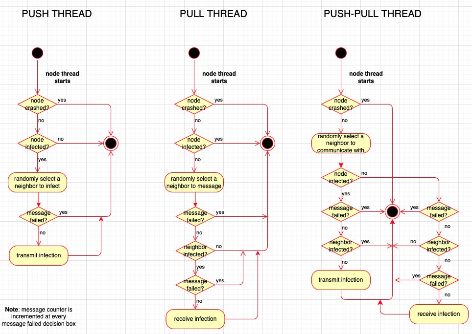

This paper addresses the study of epidemic algorithms for information dissemination in a network, a scope of the CU (curricular unit) of Distributed Systems. Only anti entropy type algorithms were considered in this study for simulation, that was developed with python. The objective is to observe the behavior of infection and message transmission on different conditions, and conclude on what is the best algorithm.

## Solution description
In order to simulate the spreading of a message in a network and evaluate its performance, a program in a python environment was developed, as it is easy to develop with, and it's also the state-of-the-art programming language when it comes to data analysis. The goal was to analyze the behavior of the anti-entropy algorithms for a network under perfect conditions (no hardware or transmission failures), and then see what happens in more realistic conditions, i.e. with node crashes and message errors.

The program will generate as output the percentage of infected nodes by the number of rounds that were simulated, the number of infected nodes per round and the number of messages transmitted per round. It's important to note that each round relates to a time unit, that is equal to the time it takes for a message to go from one node to another (arbitrated as equal for any pair of nodes in the system), which means the simulation developed is synchronous. The output is dependent on the set of parameters that the program receives as input, which adjust either the network size and/or shape (topology, number of nodes), or the way the system behaves (first infected node, anti-entropy type, probability of a node crash, probability of a message not arriving at the destination).

The input related to the network parameters are self-explanatory and are used combined with networkx (a "python package for the creation, manipulation, and study of the structure, dynamics, and functions of complex networks") to generate the nodes and its connections. As for the other parameters, it's important to understand them as they are vital to the simulation and the analysis that will be done afterwards:
- The **first infected node** is related to the node that has the message to be transmitted through the network, and can be a random node (selected by the user), the node closest to the center, the node that has the most connections (neighbors) or the node where the node density is higher;
- **Anti-entropy type** can be one of the three already mentioned, push, pull or push-pull;
- **Probability of a node crash** refers to the probability that a node will be removed from the network, and it's arbitrated that the node won't recover for the rest of the simulation. This may occur with several nodes;
- **Probability of a message not arriving at the destination** relates to transport problems, meaning the message is transmitted but never received by the other node. This may happen several times according to the specified probability.

All the information regarding the simulation (like infected nodes, number of messages, infected nodes, etc) is kept on lists, that act just like a data structure. The simulation is based on threads, in which each thread is a representation of a node. They run "simultaneously", meaning all nodes will process its task at the exact same time (simulation time). Each thread will start knowing its 'id', and the list of neighbors that it's connected to. Then, the set of operations that will run is dependent on the anti-entropy type, and is described by the following diagrams:

©Flávio Silva, Miguel Cardoso, Manuel Hess
